# vllm-omni 并行方法全览

> 本文档系统梳理 vllm-omni 仓库中实现的所有并行策略，涵盖原理框图、代码路径、核心接口与关键参数。
> 适用版本：当前主干（`c:\Users\didan\Documents\GitHub\vllm-omni`）。

---

## 目录

1. [全局并行拓扑](#0-全局并行拓扑)
2. [Tensor Parallelism (TP)](#1-tensor-parallelism-tp)
3. [Sequence Parallelism — Ulysses-SP](#2-sequence-parallelism--ulysses-sp)
4. [Sequence Parallelism — Ring Attention](#3-sequence-parallelism--ring-attention)
5. [Hybrid SP（Ulysses × Ring）](#4-hybrid-sp--ulysses--ring)
6. [CFG-Parallel（分类器无关引导并行）](#5-cfg-parallel--分类器无关引导并行)
7. [HSDP（混合分片数据并行）](#6-hsdp--混合分片数据并行)
8. [VAE-Patch-Parallel（VAE 空间分块并行）](#7-vae-patch-parallel--vae-空间分块并行)
9. [Pipeline Parallelism (PP)](#8-pipeline-parallelism-pp)
10. [Data Parallelism (DP)](#9-data-parallelism-dp)
11. [Expert Parallelism (EP)](#10-expert-parallelism-ep)
12. [跨策略约束汇总](#跨策略约束汇总)

---

## 0. 全局并行拓扑

vllm-omni 的进程组布局由 `RankGenerator` 统一管理，采用 **`tp-sp-pp-cfg-dp`** 五维正交排列。所有进程组在启动时由 `initialize_model_parallel()` 一次性初始化完成。

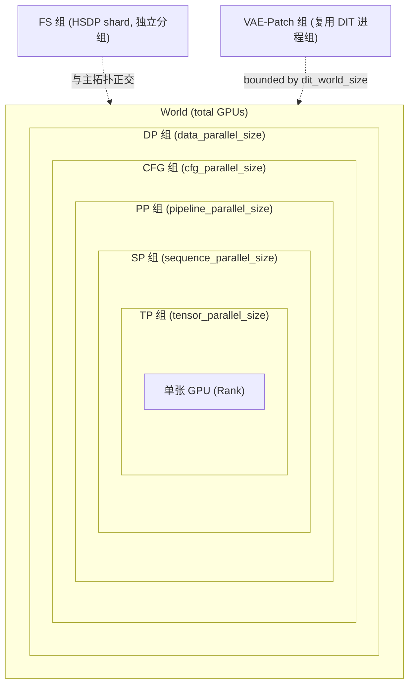

**全局排名公式**（Megatron-LM 风格）：

```
global_rank = tp_rank
            + sp_rank  * tp_size
            + pp_rank  * tp_size * sp_size
            + cfg_rank * tp_size * sp_size * pp_size
            + dp_rank  * tp_size * sp_size * pp_size * cfg_size
```

**关键文件**

| 文件 | 用途 |
|------|------|
| [`vllm_omni/diffusion/distributed/parallel_state.py`](../vllm_omni/diffusion/distributed/parallel_state.py) | `RankGenerator`、`initialize_model_parallel()`、所有进程组全局变量（`_TP`/`_SP`/`_PP`/`_CFG`/`_DP`/`_FS`） |
| [`vllm_omni/diffusion/distributed/group_coordinator.py`](../vllm_omni/diffusion/distributed/group_coordinator.py) | `GroupCoordinator`（基类）、`PipelineGroupCoordinator`、`SequenceParallelGroupCoordinator` |
| [`vllm_omni/diffusion/data.py`](../vllm_omni/diffusion/data.py) | `DiffusionParallelConfig` — 所有并行参数的统一配置入口 |

---

## 1. Tensor Parallelism (TP)

### 原理

张量并行将单个线性层（权重矩阵）沿列或行方向切分到 `tensor_parallel_size` 张 GPU 上。对于 FFN 和 Attention 投影层，通常采用 **Column-Parallel（沿输出维切分）→ Row-Parallel（沿输入维切分，输出 All-Reduce）** 配对。

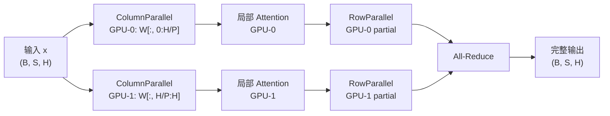

### 实现代码路径

| 文件 | 核心内容 |
|------|---------|
| [`vllm_omni/diffusion/distributed/parallel_state.py`](../vllm_omni/diffusion/distributed/parallel_state.py) | `initialize_model_parallel()` → 调用 vllm 上游初始化 `_TP` 进程组；`RankGenerator.get_ranks("tp")` 生成 TP rank 分组 |
| [`vllm_omni/diffusion/distributed/group_coordinator.py`](../vllm_omni/diffusion/distributed/group_coordinator.py) | `GroupCoordinator.all_reduce()`、`all_gather()`、`gather()`、`broadcast()` |
| [`vllm_omni/diffusion/lora/layers/column_parallel_linear.py`](../vllm_omni/diffusion/lora/layers/column_parallel_linear.py) | `DiffusionColumnParallelLinearWithLoRA`、`DiffusionMergedColumnParallelLinearWithLoRA`、`DiffusionQKVParallelLinearWithLoRA`、`DiffusionMergedQKVParallelLinearWithLoRA` |
| [`vllm_omni/diffusion/lora/layers/row_parallel_linear.py`](../vllm_omni/diffusion/lora/layers/row_parallel_linear.py) | `DiffusionRowParallelLinearWithLoRA` |
| [`vllm_omni/diffusion/models/z_image/z_image_transformer.py`](../vllm_omni/diffusion/models/z_image/z_image_transformer.py) | 模型中 `QKVParallelLinear` + `RowParallelLinear` + `MergedColumnParallelLinear` 的典型使用示例 |
| [`docs/design/feature/tensor_parallel.md`](design/feature/tensor_parallel.md) | 设计文档，含层类型映射表 |

### 核心接口与关键参数

| 接口 / 参数 | 位置 | 说明 |
|------------|------|------|
| `DiffusionParallelConfig.tensor_parallel_size` | `vllm_omni/diffusion/data.py` | TP 并行度，即权重切分的 GPU 数量 |
| `initialize_model_parallel(tensor_parallel_size=N)` | `parallel_state.py` | 初始化全部进程组的统一入口 |
| `GroupCoordinator.all_reduce(input_, op)` | `group_coordinator.py` | RowParallel 输出的跨 TP rank 规约 |
| `GroupCoordinator.all_gather(input_, dim)` | `group_coordinator.py` | 沿指定维度汇聚分片张量 |
| `QKVParallelLinear(hidden_size, head_size, total_num_heads, ...)` | vllm 上游层 | QKV 列并行投影，自动处理 GQA |
| `RowParallelLinear(input_size, output_size, input_is_parallel=True, ...)` | vllm 上游层 | 行并行投影 + All-Reduce |
| `MergedColumnParallelLinear` | vllm 上游层 | SwiGLU gate+up 合并列并行 |

> **约束：** HSDP 启用时要求 `tensor_parallel_size = 1`。

---

## 2. Sequence Parallelism — Ulysses-SP

### 原理

DeepSpeed Ulysses 方案：各 GPU 持有序列的 `1/P` 分片（`P = ulysses_degree`）。在进入 Attention 前通过 **All-to-All** 将张量从 `(B, S/P, H, D)` 变换为 `(B, S, H/P, D)`（序列维→头维），Attention 核对完整序列但仅对 `H/P` 个头计算；Attention 后再反向 All-to-All 恢复为 `(B, S/P, H, D)`。

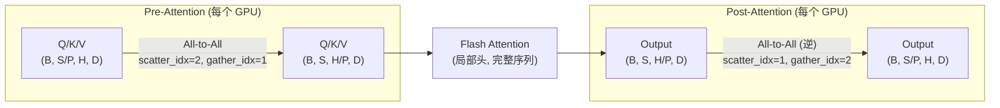

当模型含 **joint（文本条件）tokens** 时：图像 tokens 经 All-to-All 交换；文本 tokens 在各 Ulysses rank 上保持完整副本（按头维切片），Attention 后通过 `all_gather` 在头维重组。

### 实现代码路径

| 文件 | 核心内容 |
|------|---------|
| [`vllm_omni/diffusion/distributed/comm.py`](../vllm_omni/diffusion/distributed/comm.py) | `all_to_all_4D()`、`all_to_all_5D()`、`SeqAllToAll4D`（autograd Function）、`SeqAllToAll5D` |
| [`vllm_omni/diffusion/attention/parallel/ulysses.py`](../vllm_omni/diffusion/attention/parallel/ulysses.py) | `UlyssesParallelAttention.pre_attention()`、`post_attention()`、`_UlyssesCtx` |
| [`vllm_omni/diffusion/attention/parallel/factory.py`](../vllm_omni/diffusion/attention/parallel/factory.py) | `build_parallel_attention_strategy()` — 根据 `ulysses_degree`/`ring_degree` 选择策略 |
| [`vllm_omni/diffusion/attention/parallel/base.py`](../vllm_omni/diffusion/attention/parallel/base.py) | `ParallelAttentionStrategy` 协议定义、`NoParallelAttention` |
| [`vllm_omni/diffusion/distributed/parallel_state.py`](../vllm_omni/diffusion/distributed/parallel_state.py) | `get_ulysses_parallel_world_size()`、`get_ulysses_parallel_rank()` |

### 核心接口与关键参数

| 接口 / 参数 | 位置 | 说明 |
|------------|------|------|
| `DiffusionParallelConfig.ulysses_degree` | `data.py` | Ulysses All-to-All 分组大小 |
| `SeqAllToAll4D.apply(pg, input, scatter_idx, gather_idx, use_sync)` | `comm.py` | 核心 All-to-All 算子，支持自动反向传播 |
| `UlyssesParallelAttention(sp_group, scatter_idx, gather_idx, use_sync)` | `ulysses.py` | 策略对象，`pre_attention()` + `post_attention()` 成对调用 |
| `scatter_idx` | `ulysses.py` | 前向散射维度（通常为 `2`，即头维） |
| `gather_idx` | `ulysses.py` | 前向聚集维度（通常为 `1`，即序列维） |
| `use_sync` | `ulysses.py` | 是否在 All-to-All 后插入同步屏障 |
| `joint_strategy` | `AttentionMetadata` | `"front"` 或 `"rear"`，控制文本条件 tokens 的拼接位置 |

---

## 3. Sequence Parallelism — Ring Attention

### 原理

Ring Attention 方案：各 GPU 持有序列的 `1/P` 分片（`P = ring_degree`）。每步将本地 K、V 通过 **P2P send/recv** 传递给环中下一个 rank，同时从上一个 rank 接收新的 K、V；并行计算对当前 K/V 的局部 Attention，使用**在线 Softmax（log-sum-exp 累积）** 跨环步安全合并。共需 `P` 个环步完成完整 Attention。

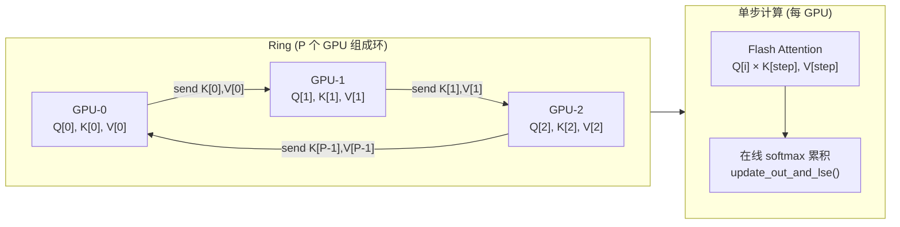

**joint tokens** 在 `step=0` 时拼接到 K/V（由 `joint_strategy` 决定前/后），之后各步仅传递图像 K/V。

### 实现代码路径

| 文件 | 核心内容 |
|------|---------|
| [`vllm_omni/diffusion/distributed/comm.py`](../vllm_omni/diffusion/distributed/comm.py) | `RingComm`：`send_recv()`、`commit()`（`batch_isend_irecv`）、`wait()` |
| [`vllm_omni/diffusion/attention/parallel/ring.py`](../vllm_omni/diffusion/attention/parallel/ring.py) | `RingParallelAttention`：`pre_attention()`、`run_attention()`、`post_attention()` |
| [`vllm_omni/diffusion/attention/backends/ring_flash_attn.py`](../vllm_omni/diffusion/attention/backends/ring_flash_attn.py) | `ring_flash_attn_forward()`、`ring_flash_attn_func`（autograd 包装） |
| [`vllm_omni/diffusion/attention/backends/ring_pytorch_attn.py`](../vllm_omni/diffusion/attention/backends/ring_pytorch_attn.py) | `ring_pytorch_attn_func`：基于 SDPA 的 Ring Attention 回退实现 |
| [`vllm_omni/diffusion/attention/backends/ring/ring_utils.py`](../vllm_omni/diffusion/attention/backends/ring/ring_utils.py) | `update_out_and_lse(out, lse, block_out, block_lse)` — 数值稳定的在线 softmax 累积 |
| [`vllm_omni/diffusion/attention/backends/ring/ring_selector.py`](../vllm_omni/diffusion/attention/backends/ring/ring_selector.py) | `AttnType` 枚举（FA2/FA3/AITER/FLASHINFER/TORCH/SAGE）、`select_flash_attn_impl()` |
| [`vllm_omni/diffusion/attention/backends/ring/ring_kernels.py`](../vllm_omni/diffusion/attention/backends/ring/ring_kernels.py) | 各后端底层 kernel 包装：`flash_attn_forward`、`flash_attn3_func_forward`、`flashinfer_attn_forward` 等 |
| [`vllm_omni/diffusion/attention/backends/ring/ring_globals.py`](../vllm_omni/diffusion/attention/backends/ring/ring_globals.py) | 可用性标志：`HAS_FLASH_ATTN`、`HAS_FA3`、`HAS_AITER`、`HAS_FLASHINFER` 等 |

### 核心接口与关键参数

| 接口 / 参数 | 位置 | 说明 |
|------------|------|------|
| `DiffusionParallelConfig.ring_degree` | `data.py` | Ring Attention 环大小（GPU 数量） |
| `RingComm(process_group)` | `comm.py` | 环形 P2P 通信器，管理异步 send/recv 管道 |
| `ring_flash_attn_forward(process_group, q, k, v, softmax_scale, dropout_p, causal, joint_tensor_key, joint_tensor_value, joint_strategy)` | `ring_flash_attn.py` | Flash Attention 后端的完整环步循环 |
| `RingParallelAttention(sp_group, attn_backend_pref)` | `ring.py` | 策略对象，`run_attention()` 调度后端 |
| `attn_backend_pref` | `ring.py` | 指定优先使用的 attention 后端（`None` 为自动选择） |
| `causal` | `ring_flash_attn.py` | 是否使用因果掩码（仅在 `step=0` 启用） |
| `update_out_and_lse(out, lse, block_out, block_lse)` | `ring_utils.py` | 在线 softmax 数值安全合并，供环步循环使用 |

---

## 4. Hybrid SP（Ulysses × Ring）

### 原理

混合序列并行将 `sequence_parallel_size` 个 GPU 分为两级：**外层 Ulysses 组**（大小 `ulysses_degree`）和**内层 Ring 组**（大小 `ring_degree`）。Ulysses 负责头维 All-to-All，Ring 负责 K/V 环传；两者组合可同时处理头数限制（Ulysses 要求 `H % ulysses_degree = 0`）和超长序列（Ring 无头数约束）。

模型通过声明 `_sp_plan` 字典并注册 Hook 来实现非侵入式序列分片与汇聚：

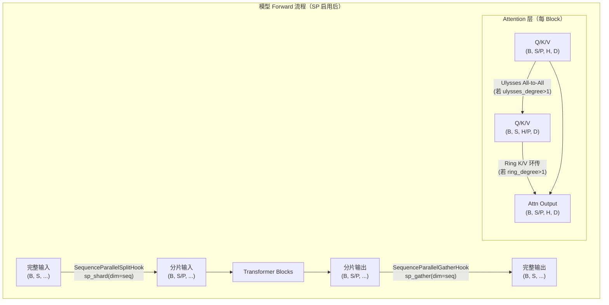

**`_sp_plan` 机制** — 模型类属性，key 为子模块名，value 为 `SequenceParallelInput`/`SequenceParallelOutput`/`SequenceParallelPartialInput` 实例，声明各子模块需要在哪个维度做分片/汇聚及是否自动 padding。

### 实现代码路径

| 文件 | 核心内容 |
|------|---------|
| [`vllm_omni/diffusion/distributed/parallel_state.py`](../vllm_omni/diffusion/distributed/parallel_state.py) | `set_seq_parallel_pg(sp_ulysses_degree, sp_ring_degree, rank, world_size, use_ulysses_low, sp_group_ranks)` — 创建 Ulysses 和 Ring 子进程组 |
| [`vllm_omni/diffusion/distributed/group_coordinator.py`](../vllm_omni/diffusion/distributed/group_coordinator.py) | `SequenceParallelGroupCoordinator`：持有 `ulysses_group`、`ring_group`、`ulysses_world_size`、`ulysses_rank`、`ring_world_size`、`ring_rank` |
| [`vllm_omni/diffusion/distributed/sp_plan.py`](../vllm_omni/diffusion/distributed/sp_plan.py) | `SequenceParallelConfig`、`SequenceParallelInput`、`SequenceParallelOutput`、`SequenceParallelPartialInput`、`validate_sp_plan()`、`get_sp_plan_from_model()` |
| [`vllm_omni/diffusion/distributed/sp_sharding.py`](../vllm_omni/diffusion/distributed/sp_sharding.py) | `sp_shard(tensor, dim)`、`sp_gather(tensor, dim)`、`sp_shard_with_padding()`、`ShardingValidator` |
| [`vllm_omni/diffusion/hooks/sequence_parallel.py`](../vllm_omni/diffusion/hooks/sequence_parallel.py) | `SequenceParallelSplitHook`、`SequenceParallelGatherHook`、`apply_sequence_parallel()`、`remove_sequence_parallel()`、`enable_sequence_parallel_for_model()`、`disable_sequence_parallel_for_model()` |
| [`vllm_omni/diffusion/attention/parallel/factory.py`](../vllm_omni/diffusion/attention/parallel/factory.py) | `build_parallel_attention_strategy()` — 读取 forward context，决定使用 Ulysses/Ring/Hybrid/NoParallel |
| [`docs/design/feature/sequence_parallel.md`](design/feature/sequence_parallel.md) | 设计文档，含两种集成方案（Hook 式 vs 侵入式） |

**已集成 `_sp_plan` 的模型**

| 模型 | 文件 |
|------|------|
| Z-Image | `vllm_omni/diffusion/models/z_image/z_image_transformer.py` |
| Qwen-Image | `vllm_omni/diffusion/models/qwen_image/qwen_image_transformer.py` |
| Wan2.2 | `vllm_omni/diffusion/models/wan2_2/wan2_2_transformer.py` |
| LongCat-Image | `vllm_omni/diffusion/models/longcat_image/longcat_image_transformer.py` |
| Flux2-Klein | `vllm_omni/diffusion/models/flux2_klein/flux2_klein_transformer.py` |
| Helios | `vllm_omni/diffusion/models/helios/helios_transformer.py` |
| LTX2 | `vllm_omni/diffusion/models/ltx2/ltx2_transformer.py` |

### 核心接口与关键参数

| 接口 / 参数 | 位置 | 说明 |
|------------|------|------|
| `DiffusionParallelConfig.sequence_parallel_size` | `data.py` | 总 SP 并行度，必须等于 `ulysses_degree × ring_degree` |
| `DiffusionParallelConfig.ulysses_degree` | `data.py` | Ulysses All-to-All 组大小 |
| `DiffusionParallelConfig.ring_degree` | `data.py` | Ring 环大小 |
| `set_seq_parallel_pg(sp_ulysses_degree, sp_ring_degree, rank, world_size, use_ulysses_low, sp_group_ranks)` | `parallel_state.py` | 初始化 SP 内的 Ulysses / Ring 子进程组 |
| `use_ulysses_low` | `parallel_state.py` | `True`：Ulysses 组连续分配，Ring 组跨步；`False`：反之 |
| `enable_sequence_parallel_for_model(model, config)` | `sequence_parallel.py` | 读取 `model._sp_plan`，为模型注册分片/汇聚 Hook |
| `SequenceParallelInput(split_dim, expected_dims, split_output, auto_pad)` | `sp_plan.py` | 声明输入张量的分片维度；`auto_pad=True` 时自动补零 padding |
| `SequenceParallelOutput(gather_dim, expected_dims)` | `sp_plan.py` | 声明输出张量的汇聚维度 |
| `SequenceParallelPartialInput(split_dim, text_len_source, expected_dims, split_output)` | `sp_plan.py` | 混合文本+图像张量：文本部分保持完整，仅对图像部分分片 |
| `sp_shard(tensor, dim, validate)` | `sp_sharding.py` | 沿 `dim` 切取本 rank 对应的序列分片 |
| `sp_gather(tensor, dim, validate)` | `sp_sharding.py` | All-Gather，沿 `dim` 重组完整张量 |
| `ShardingValidator` | `sp_sharding.py` | 调试工具，追踪分片/汇聚配对，检测不匹配 |

> **约束：** `sequence_parallel_size = ulysses_degree × ring_degree`（硬性校验）。纯 Ulysses 支持 `auto_pad`；Ring 模式要求序列长度可被 `ring_degree` 整除。

---

## 5. CFG-Parallel（分类器无关引导并行）

### 原理

Classifier-Free Guidance（CFG）在标准实现中需要对同一张 latent 做两次前向（正向提示 + 负向提示），再线性组合。CFG-Parallel 将这两次前向分配到不同 GPU 上同步执行：**Rank 0 执行条件（正向）前向，Rank 1 执行无条件（负向）前向**；然后 All-Gather 结果，在 Rank 0 计算 `noise = neg + scale × (pos − neg)`，最后 broadcast 新 latent 到所有 rank。

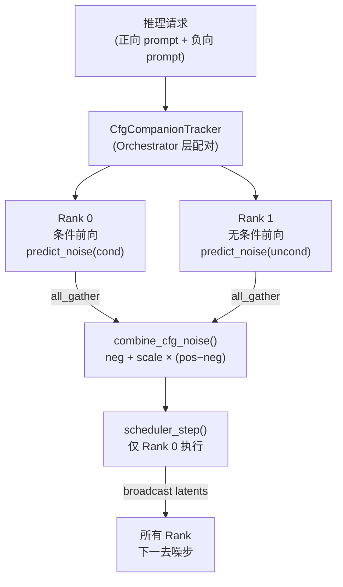

`cfg_parallel_size = 3` 时，Rank 2 用于三路 CFG（如 layered 模型的前景/背景分离）。

### 实现代码路径

| 文件 | 核心内容 |
|------|---------|
| [`vllm_omni/diffusion/distributed/cfg_parallel.py`](../vllm_omni/diffusion/distributed/cfg_parallel.py) | `CFGParallelMixin`：`predict_noise_maybe_with_cfg()`、`scheduler_step_maybe_with_cfg()`、`combine_cfg_noise()`、`cfg_normalize_function()` |
| [`vllm_omni/diffusion/models/qwen_image/cfg_parallel.py`](../vllm_omni/diffusion/models/qwen_image/cfg_parallel.py) | `QwenImageCFGParallelMixin`：实现 `diffuse()` 循环及 `check_cfg_parallel_validity()` |
| [`vllm_omni/diffusion/distributed/parallel_state.py`](../vllm_omni/diffusion/distributed/parallel_state.py) | `get_cfg_group()`、`get_classifier_free_guidance_world_size()`、`get_classifier_free_guidance_rank()` |
| [`vllm_omni/entrypoints/cfg_companion_tracker.py`](../vllm_omni/entrypoints/cfg_companion_tracker.py) | `CfgCompanionTracker`：Orchestrator 层的正/负请求配对、延迟转发、超时处理 |
| [`vllm_omni/entrypoints/cli/serve.py`](../vllm_omni/entrypoints/cli/serve.py) | `--cfg-parallel-size` CLI 参数 |
| [`docs/design/feature/cfg_parallel.md`](design/feature/cfg_parallel.md) | 设计文档，含多 pipeline 阶段的协作机制 |

### 核心接口与关键参数

| 接口 / 参数 | 位置 | 说明 |
|------------|------|------|
| `DiffusionParallelConfig.cfg_parallel_size` | `data.py` | CFG 并行度，取值 `{1, 2, 3}` |
| `--cfg-parallel-size` | CLI `serve.py` | 与上同，命令行入口 |
| `CFGParallelMixin.predict_noise_maybe_with_cfg(latent, timestep, ...)` | `cfg_parallel.py` | 根据当前 CFG rank 自动分派正/负前向，or 非并行时正常调用 |
| `CFGParallelMixin.combine_cfg_noise(pos_noise, neg_noise, cfg_scale)` | `cfg_parallel.py` | CFG 噪声合并公式；可被子类重写实现模型特定归一化 |
| `CFGParallelMixin.scheduler_step_maybe_with_cfg(scheduler, noise, latent, t, ...)` | `cfg_parallel.py` | 仅 Rank 0 执行调度步，然后 broadcast 新 latent |
| `true_cfg_scale` | 推理采样参数 | CFG 权重；`<= 1.0` 时退化为非 CFG 推理 |
| `CfgCompanionTracker` | `cfg_companion_tracker.py` | Orchestrator 侧请求配对器；`VLLM_CFG_PENDING_TIMEOUT_S` 控制等待超时 |

> **约束：** `cfg_parallel_size ∈ {1, 2, 3}`（代码硬校验）。启用 CFG-Parallel 时需同时提供负向 prompt 且 `true_cfg_scale > 1.0`。

---

## 6. HSDP（混合分片数据并行）

### 原理

HSDP（Hybrid Sharded Data Parallelism）基于 PyTorch FSDP2（`torch.distributed.fsdp.fully_shard`），构建二维设备网格 `(replicate, shard)`：

- **shard 维度**（大小 `hsdp_shard_size`）：模型权重在这些 GPU 上被 FSDP2 切分，前向时按需 All-Gather 重组，用后丢弃，极大降低单卡显存峰值。
- **replicate 维度**（大小 `hsdp_replicate_size`）：持有完整权重副本的数据并行组，训练时需 Reduce-Scatter 梯度（推理时此维度仅作逻辑分组）。

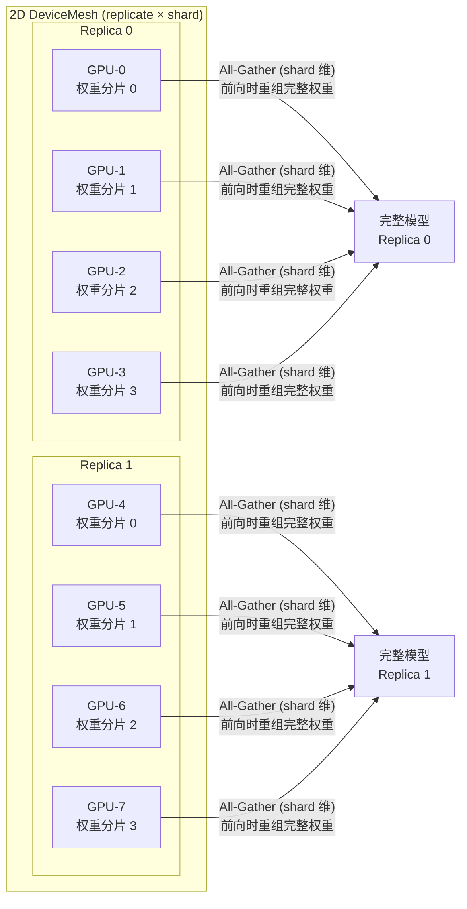

推理时 `reshard_after_forward=True`，前向完成后立即丢弃重组权重以释放显存。

### 实现代码路径

| 文件 | 核心内容 |
|------|---------|
| [`vllm_omni/diffusion/distributed/hsdp.py`](../vllm_omni/diffusion/distributed/hsdp.py) | `HSDPInferenceConfig`、`_create_hsdp_mesh()`、`apply_hsdp_to_model()`、`shard_model()` |
| [`vllm_omni/diffusion/distributed/parallel_state.py`](../vllm_omni/diffusion/distributed/parallel_state.py) | `_FS`（Fully Shard 进程组）、`get_fs_group()`、`get_fully_shard_rank()`、`get_fully_shard_world_size()` |
| [`vllm_omni/diffusion/data.py`](../vllm_omni/diffusion/data.py) | `DiffusionParallelConfig.use_hsdp`、`hsdp_shard_size`、`hsdp_replicate_size` |
| [`docs/design/feature/hsdp.md`](design/feature/hsdp.md) | 设计文档，含内存分析与使用指南 |

### 核心接口与关键参数

| 接口 / 参数 | 位置 | 说明 |
|------------|------|------|
| `DiffusionParallelConfig.use_hsdp` | `data.py` | 是否启用 HSDP |
| `DiffusionParallelConfig.hsdp_shard_size` | `data.py` | shard 组大小（`-1` = 自动，等于世界大小） |
| `DiffusionParallelConfig.hsdp_replicate_size` | `data.py` | 副本组数量 |
| `HSDPInferenceConfig(enabled, hsdp_replicate_size, hsdp_shard_size, param_dtype, reduce_dtype, reshard_after_forward)` | `hsdp.py` | 运行时 HSDP 配置，由 `DiffusionParallelConfig` 转换而来 |
| `apply_hsdp_to_model(model, config, device_type)` | `hsdp.py` | 在已加载模型上应用 FSDP2 权重分片，冻结所有参数 |
| `_create_hsdp_mesh(device_type, replicate_size, shard_pg)` | `hsdp.py` | 创建 `(replicate, shard)` 二维 `DeviceMesh` |
| `get_fs_group()` | `parallel_state.py` | 获取 `_FS` GroupCoordinator（shard 维进程组） |
| `model._hsdp_shard_conditions` | 各模型类 | 模型自定义的子模块筛选规则，决定哪些模块被 FSDP2 包裹 |

> **约束：** `use_hsdp = True` 时强制要求 `tensor_parallel_size = 1` 且 `data_parallel_size = 1`；`hsdp_shard_size × hsdp_replicate_size = world_size`。

---

## 7. VAE-Patch-Parallel（VAE 空间分块并行）

### 原理

VAE 解码是高分辨率生成的显存瓶颈。VAE-Patch-Parallel 将 latent 张量在**空间维（H × W）** 分割为若干块，分配到 `vae_patch_parallel_size` 个 rank 上并行解码，最后在 Rank 0 拼接并广播。

根据 latent 大小自动选择两种策略：

- **Tiled Decode**（latent 大于阈值）：复用 diffusers 的滑动窗口瓦片解码，每个 rank 负责不同瓦片集合，自动处理边缘混合。
- **Patch Decode**（latent 小于阈值）：每个 rank 解码一个空间块（含 halo 重叠区），最终裁剪 halo 后拼接。

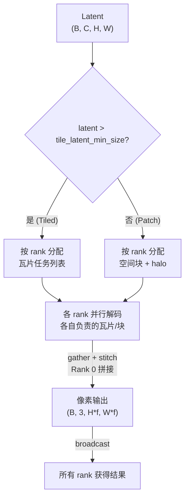

OOP 框架（`DistributedVaeExecutor`）进一步将 split/exec/merge 封装为 `DistributedOperator` 策略对象，支持多种 VAE 架构。

### 实现代码路径

| 文件 | 核心内容 |
|------|---------|
| [`vllm_omni/diffusion/distributed/vae_patch_parallel.py`](../vllm_omni/diffusion/distributed/vae_patch_parallel.py) | `VaePatchParallelism`、`_distributed_tiled_decode()`、`_distributed_patch_decode()`、`maybe_wrap_vae_decode_with_patch_parallelism()` |
| [`vllm_omni/diffusion/distributed/autoencoders/distributed_vae_executor.py`](../vllm_omni/diffusion/distributed/autoencoders/distributed_vae_executor.py) | `DistributedVaeExecutor`：`set_parallel_size()`、`execute(z, operator, broadcast_result)`；`DistributedVaeMixin`；`GridSpec`、`TileTask`、`DistributedOperator` |
| [`vllm_omni/diffusion/distributed/autoencoders/autoencoder_kl.py`](../vllm_omni/diffusion/distributed/autoencoders/autoencoder_kl.py) | `DistributedAutoencoderKL`：`tile_split/tile_exec/tile_merge`、`patch_split/patch_exec/patch_merge`、`_strategy_select()` |
| [`vllm_omni/diffusion/distributed/autoencoders/autoencoder_kl_wan.py`](../vllm_omni/diffusion/distributed/autoencoders/autoencoder_kl_wan.py) | `DistributedAutoencoderKLWan`：Wan2.2 专用分布式 VAE |
| [`vllm_omni/diffusion/distributed/autoencoders/autoencoder_kl_qwenimage.py`](../vllm_omni/diffusion/distributed/autoencoders/autoencoder_kl_qwenimage.py) | `DistributedAutoencoderKLQwenImage`：Qwen-Image 专用分布式 VAE |
| [`vllm_omni/diffusion/registry.py`](../vllm_omni/diffusion/registry.py) | 模型注册后自动检测 `DistributedVaeMixin`、auto-enable `vae_use_tiling`、调用 `model.vae.set_parallel_size()` |
| [`docs/design/feature/vae_parallel.md`](design/feature/vae_parallel.md) | 设计文档，含策略选择逻辑与内存分析 |

### 核心接口与关键参数

| 接口 / 参数 | 位置 | 说明 |
|------------|------|------|
| `DiffusionParallelConfig.vae_patch_parallel_size` | `data.py` | VAE 解码并行度（自动 clamp 为 `≤ dit_world_size`） |
| `--vae-patch-parallel-size` | CLI `serve.py` | 与上同，命令行入口 |
| `vae_use_tiling` | `OmniDiffusionConfig` | 必须为 `True`；`vae_patch_parallel_size > 1` 时由 registry 自动设置 |
| `maybe_wrap_vae_decode_with_patch_parallelism(pipeline, vae_patch_parallel_size, group_getter)` | `vae_patch_parallel.py` | 运行时将 `pipeline.vae.decode` 替换为分布式版本（duck-typing 注入） |
| `DistributedVaeMixin.set_parallel_size(size)` | `distributed_vae_executor.py` | 动态设置 VAE 解码的并行度 |
| `DistributedVaeExecutor.execute(z, operator, broadcast_result=True)` | `distributed_vae_executor.py` | 执行分布式解码：分发任务 → 各 rank 解码 → Rank 0 拼接 → 可选 broadcast |
| `DistributedOperator(split, exec, merge)` | `distributed_vae_executor.py` | 拆分/解码/合并三段逻辑的策略封装 |
| `GridSpec(split_dims, grid_shape, tile_spec, output_dtype)` | `distributed_vae_executor.py` | 描述瓦片网格布局的元数据 |

---

## 8. Pipeline Parallelism (PP)

### 原理

流水线并行将模型层（Transformer blocks）按深度切分为 `pipeline_parallel_size` 个 **stage**，每个 stage 由一组 GPU 负责。相邻 stage 之间通过 **P2P send/recv** 传递激活张量（PipeFusion 风格：预分配接收缓冲区，非阻塞发送 + 等待接收，隐藏通信延迟）。跳跃连接（skip-connection）使用专门的 `skip_device_group` 进行非相邻 rank 间通信。

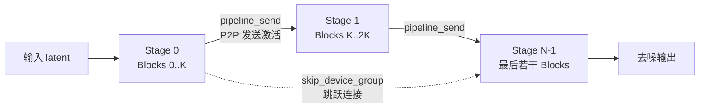

### 实现代码路径

| 文件 | 核心内容 |
|------|---------|
| [`vllm_omni/diffusion/distributed/group_coordinator.py`](../vllm_omni/diffusion/distributed/group_coordinator.py) | `PipelineGroupCoordinator`：`pipeline_send()`、`pipeline_recv()`、`pipeline_isend()`（非阻塞）、`add_pipeline_recv_task()`/`recv_next()`/`get_pipeline_recv_data()`（异步接收队列）、`pipeline_send_skip()`/`pipeline_recv_skip()`（跳跃连接）、`set_recv_buffer()` |
| [`vllm_omni/diffusion/distributed/parallel_state.py`](../vllm_omni/diffusion/distributed/parallel_state.py) | `_PP`、`get_pp_group()`、`get_pipeline_parallel_rank()`、`get_pipeline_parallel_world_size()`、`is_pipeline_first_stage()`、`is_pipeline_last_stage()` |
| [`vllm_omni/diffusion/data.py`](../vllm_omni/diffusion/data.py) | `DiffusionParallelConfig.pipeline_parallel_size` |

### 核心接口与关键参数

| 接口 / 参数 | 位置 | 说明 |
|------------|------|------|
| `DiffusionParallelConfig.pipeline_parallel_size` | `data.py` | 流水线 stage 数量 |
| `PipelineGroupCoordinator.pipeline_send(tensor, dst, dtype)` | `group_coordinator.py` | 同步发送激活到下一 stage |
| `PipelineGroupCoordinator.pipeline_isend(tensor, dst, dtype)` | `group_coordinator.py` | 非阻塞发送（返回 work handle） |
| `PipelineGroupCoordinator.pipeline_recv(size, dtype, src)` | `group_coordinator.py` | 阻塞接收来自上一 stage 的激活 |
| `PipelineGroupCoordinator.set_recv_buffer(tensor)` | `group_coordinator.py` | PipeFusion：预分配接收缓冲区，避免频繁内存分配 |
| `is_pipeline_first_stage()` / `is_pipeline_last_stage()` | `parallel_state.py` | 判断当前 rank 是否为首/末 stage，用于控制输入接收和输出产生 |

> **约束：** NPU 平台当前不支持 PP（`pipeline_parallel_size = 1` 强制要求）。

---

## 9. Data Parallelism (DP)

### 原理

数据并行为**推理专用**的无梯度同步副本方案：不同请求被分配到不同 DP rank，每个 rank 持有完整模型权重副本（或与 SP/TP/PP 组合后的局部副本），彼此独立处理各自的 batch，无需跨 rank 通信。

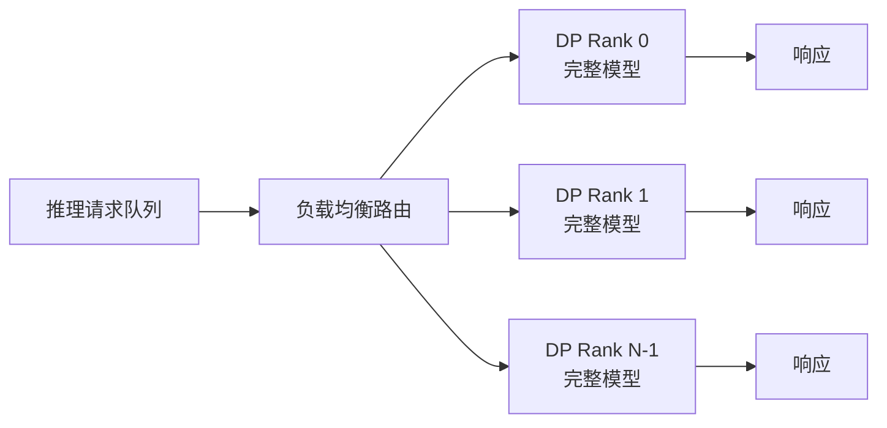

### 实现代码路径

| 文件 | 核心内容 |
|------|---------|
| [`vllm_omni/diffusion/distributed/parallel_state.py`](../vllm_omni/diffusion/distributed/parallel_state.py) | `_DP`、`get_dp_group()`、`get_data_parallel_rank()`、`get_data_parallel_world_size()`、`is_dp_last_group()` |
| [`vllm_omni/diffusion/data.py`](../vllm_omni/diffusion/data.py) | `DiffusionParallelConfig.data_parallel_size` |

### 核心接口与关键参数

| 接口 / 参数 | 位置 | 说明 |
|------------|------|------|
| `DiffusionParallelConfig.data_parallel_size` | `data.py` | DP 副本数量 |
| `get_dp_group()` | `parallel_state.py` | 获取 `_DP` GroupCoordinator |
| `get_data_parallel_rank()` / `get_data_parallel_world_size()` | `parallel_state.py` | 查询当前 DP rank 及总数 |
| `is_dp_last_group()` | `parallel_state.py` | 判断当前 rank 是否属于最后一个 DP/SP/CFG/PP 组合（用于日志/barrier 控制） |

> **约束：** `use_hsdp = True` 时强制 `data_parallel_size = 1`。

---

## 10. Expert Parallelism (EP)

### 原理

专家并行用于 **Mixture-of-Experts（MoE）** 架构。模型中每个 MoE 层的专家（Expert FFN）被分配到不同 EP rank，各 rank 仅存储并计算其负责的专家子集。Token 路由（gating）结果决定每个 token 发往哪个 EP rank，通过 All-to-All 完成 token 的跨 rank 分发与结果汇聚。非 MoE 层仍使用 TP。

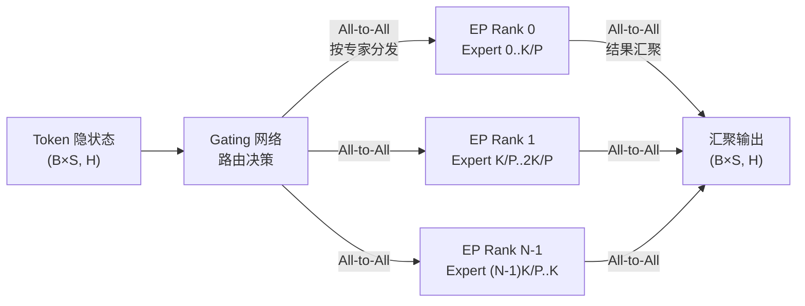

### 实现代码路径

| 文件 | 核心内容 |
|------|---------|
| [`vllm_omni/diffusion/distributed/parallel_state.py`](../vllm_omni/diffusion/distributed/parallel_state.py) | EP 进程组初始化（条件启用，当 `enable_expert_parallel=True` 且模型为 MoE 时）；`RankGenerator` 中 `ep` 维度计算：`ep = tp × sp × cfg × dp`（PP 每个 stage 独立设置 EP 组） |
| [`vllm_omni/platforms/npu/models/hunyuan_fused_moe.py`](../vllm_omni/platforms/npu/models/hunyuan_fused_moe.py) | NPU 平台 MoE 层的 EP 使用示例 |
| [`vllm_omni/diffusion/data.py`](../vllm_omni/diffusion/data.py) | `DiffusionParallelConfig.enable_expert_parallel` |

### 核心接口与关键参数

| 接口 / 参数 | 位置 | 说明 |
|------------|------|------|
| `DiffusionParallelConfig.enable_expert_parallel` | `data.py` | 是否为 MoE 模型启用专家并行 |
| `initialize_model_parallel(enable_expert_parallel=True)` | `parallel_state.py` | 触发 EP 进程组初始化（同时需要 `OmniDiffusionConfig.is_moe = True`） |
| vllm 上游 EP 路由层 | vllm core | 实际 All-to-All 路由逻辑由 vllm 上游的 `FusedMoE` 层处理 |

> **约束：** `enable_expert_parallel = True` 时模型必须含 MoE 层（`is_moe = True`）。EP 组的 world size = `tp × sp × cfg × dp`（每个 PP stage 内独立）。

---

## 跨策略约束汇总

| 约束 | 说明 |
|------|------|
| `sequence_parallel_size = ulysses_degree × ring_degree` | 硬性校验，`DiffusionParallelConfig._validate_parallel_config` 中断言 |
| `cfg_parallel_size ∈ {1, 2, 3}` | 代码硬限制 |
| `use_hsdp = True` ⟹ `tensor_parallel_size = 1` | HSDP 与 TP 互斥 |
| `use_hsdp = True` ⟹ `data_parallel_size = 1` | HSDP 与 DP 互斥 |
| `hsdp_shard_size × hsdp_replicate_size = world_size` | HSDP 内部约束 |
| `world_size = tp × sp × pp × cfg × dp` | 总 world size 等于五维乘积 |
| `vae_patch_parallel_size ≤ dit_world_size` | registry 自动 clamp |
| `vae_patch_parallel_size > 1` ⟹ `vae_use_tiling = True` | registry 自动启用 |
| Ring Attention: `S % ring_degree = 0` | 序列长度必须可被 Ring 度整除 |
| Ulysses-SP: `H % ulysses_degree = 0` | 注意力头数必须可被 Ulysses 度整除 |
| PP 在 NPU 平台: `pipeline_parallel_size = 1` | NPU 不支持 PP |
| EP: 需 `OmniDiffusionConfig.is_moe = True` | 仅 MoE 模型可启用专家并行 |

---

## 附录：`DiffusionParallelConfig` 完整参数速览

```python
# vllm_omni/diffusion/data.py
@config
@dataclass
class DiffusionParallelConfig:
    pipeline_parallel_size: int = 1       # PP stage 数
    data_parallel_size: int = 1           # DP 副本数
    tensor_parallel_size: int = 1         # TP 权重切分数
    enable_expert_parallel: bool = False  # MoE 专家并行开关
    sequence_parallel_size: int | None = None  # SP 总并行度（= ulysses × ring）
    ulysses_degree: int = 1               # Ulysses All-to-All 组大小
    ring_degree: int = 1                  # Ring 环大小
    cfg_parallel_size: int = 1            # CFG 并行度 {1, 2, 3}
    vae_patch_parallel_size: int = 1      # VAE 空间分块并行度
    use_hsdp: bool = False                # HSDP 开关
    hsdp_shard_size: int = -1             # HSDP shard 组大小（-1 = 自动）
    hsdp_replicate_size: int = 1          # HSDP 副本组数
```
